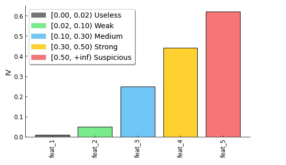

# A sklearn-compatible WOE encoder :blush:

用这个，你至少要大概明白 WOE 编码是个啥。这里只会帮你写代码，避免你重复造轮子，不负责讲解 WOE 原理。而且这里只有 WOE 编码，没有其他的。

<Br>

## :one: Features

对于离散型特征和连续型特征均实现了以下 3 种 WOE 编码：

1. **基于最大分箱数的卡方分箱法**
2. **基于阈值的卡方分箱法**
3. **基于最大分箱数的坏样本率差异最大化分箱法**

> 由于没有一个指导阈值来决定多大的坏样本率差值是符合条件的，基于坏样本率差异最大化的分箱方法的停止条件只有最大分箱数。

区别在于分箱过程中 bin 的原则不同以及停止条件不同。

<br>

**支持按需定制：**

- 最大样本数
- bin 内最少样本数
- （每个）特殊值单独作为一个 bin
- 缺失值单独作为一个 bin
- 单调性及 U 型

<Br>

直接看 [Examples](#two-examples) 吧。

<br>

**bin 的合并原则有：**

1. 比较每两个相邻 bin 的卡方值，然后将具有最小卡方值的相邻两个 bin 合并。用于方法 1 和 2。

2. 比较每两个相邻 bin 的坏样本率，然后将具有最小坏样本率的相邻两个 bin 合并。用于方法 3。

<br>

**分箱通常有 4 个条件需要满足：**

1. 所有相邻 bin 的卡方值大于阈值 `confidence`（方法 1）或 bin 个数小于等于 `max_bins`（方法 2 和方法 3）；

2. 每个 bin 的坏样本率 `bad_rate` 不为 0 或 1；

3. 每个 bin 内的样本比例大于阈值 `bin_pct_threshold`（通常为 5%）；

4. bin 的坏样本率 `bad_rate` 满足单调性或者 U 型（根据业务情况而定，适用于连续型特征以及离散有序特征）。

<Br>

当然，会有一些例外。

- 在实际使用中，你可能不希望某个（些）值（称之为**特殊值**）组成的 bin 参与合并。此时，你只需要在 `special_value_list` 指定就行了。（每个）特殊值组成的 bin 不参与正常分箱操作，最后会和正常分箱产生的 bin 来一起计算 WOE 和 IV。

- 如果你的特征中含有缺失值（别太多吧），而且你希望缺失值单独作为一个 bin，只在最后参与计算 WOE 和 IV。那么你需要指定一个值暂时代替缺失值就可以了（`imputation_value=xxx`）。**尤其需要注意的是** `imputation_value` 不要和特征中的其他值相同（建议从业务角度找一个绝不可能出现在特征中的值），而且 `imputation_value` 的类型要与特征的类型相同。

<br>

**对于不同的特征有不同的初始化分箱方法：**

- 连续型特征。每个 unique 值作为一个 bin 来初始化，然后将坏样本数（率）连续为 0 或 1 的 bin 合并，再对照分箱要求做后续处理。
- 离散无序型特征。先以每个 unique 值作为一个 bin 来初始化，以坏样本率 `bad_rate` 对每个 bin  编码后当作连续型特征处理，再对照分箱要求做后续处理。
- 离散有序型特征。每个特征取值当作一个 bin，然后按照特征取值的期望顺序 `value_order_dict` 对每个 bin 进行排序，再根据要求处理。在处理过程中，始终维持有序性。

<Br>

**在分箱的过程需要一直合并相邻的 bin 来满足以上 4 个条件：**

- 不满足条件 1。比较每两个相邻组的卡方值，然后将具有最小卡方值的相邻两个 bin 合并（方法 1 和 2）；比较每两个相邻 bin 的坏样本率差值，然后将具有最小坏样本率差值的相邻两个 bin合并（方法 3）。
- 不满足条件 2。定位到不满足条件 2 的 bin，在与其相邻的两个 bin 中，选择一个 bin 与之合并，选择的依据是相邻 2 个 bin 之间的卡方值（方法 1 和 2）/坏样本率差值（方法 3）更小。
- 不满足条件 3。定位到不满足条件 3 的 bin，在与其相邻的两个 bin 中，选择一个 bin 与之合并，选择的依据是相邻 2 个 bin 之间的卡方值（方法 1 和 2）/坏样本率差值（方法 3）更小。
- 不满足条件 4。比较每两个相邻组的卡方值，然后将具有最小卡方值的相邻两个 bin 合并（方法 1 和 2）；比较每两个相邻 bin 的坏样本率差值，然后将具有最小坏样本率差值的相邻两个 bin合并（方法 3）。

<br>

**为什么分箱的条件为什么是这个顺序（1 -> 2 -> 3 -> 4）？**

为了更快地满足所有所有条件。

- 满足条件 1 的过程中，条件 2、3、4 可能也会满足；
- 显然，bin 的合并会改变单调性，所以条件 4 放在最后面；
- 满足条件 2 的过程中，bin 内样本总数必然增加（可能不变）。

<Br>

**其他：**

- 在计算 WOE 时，加入了 1 个 `regularization`（默认为 1），防止计算出错；
- WOE 计算是 `ln(bad/good)`。

<Br>

## :two: Examples

>  **说明：** pandas 1.0 前后还是有区别的，建议 1.0 之后的版本。这里基于 1.0.4 开发的。

更加详细的例子

- [CategoryWOEEncoder]()
- [ContinuousWOEEncoder]()

保持文件结构不变：

```python
>>> import sys
>>>
>>> sys.path.append("your_path/woe-encoder")
```

然后


```python
>>> from woe_encoder import CategoryWOEEncoder
>>> from woe_encoder import ContinuousWOEEncoder
```

**一次只能处理一个特征。**而且，不管使用哪种分箱方法都需要指定 `col_name` 和 `target_col_name` 这两个参数。

`CategoryWOEEncoder` 和 `ContinuousWOEEncoder` 中实现的功能差不多。使用方法 sklearn 一样，这里 `transform` 会多一个以 `_woe` 为后缀的新列。

用 `CategoryWOEEncoder` 来试试吧。

```python
# 加载数据
>>> from sklearn.datasets import load_boston
>>> 
>>> bunch = load_boston()
>>> data = pd.DataFrame(bunch.data, columns=bunch.feature_names)
>>> y = bunch.target > 22.5
>>> data['y'] = y

>>> category_feature = 'RAD'
```

```python
>>> # 基于阈值的卡方分箱法
>>> encoder = CategoryWOEEncoder(
...     col_name=category_feature,
...     target_col_name='y',
...     bin_pct_threshold=0.05,  # default, 每个 bin 的最少样本数
...     woe_method='chi2',       # default, 基于卡方的分箱
...     min_chi2_flag=True,      # default, 按照卡方阈值停止
...     confidence=3.841,        # default, 卡方阈值
... )
>>> encoder.fit(data)
>>> encoder.bin_result_   # 分箱结果的展示
>>> encoder.iv_   # 分箱的评估指标——IV 值
>>> data_transformed = encoder.transform(data)  # 多一列 category_feature+'_woe'
```

```python
>>> # 基于最大分箱数的卡方分箱法
>>> encoder = CategoryWOEEncoder(
...     col_name=category_feature,
...     target_col_name='y',
...     max_bins=10,             # default
...     bin_pct_threshold=0.05,  # default, 每个 bin 的最少样本数
...     woe_method='chi2',       # default, 基于卡方的分箱
...     min_chi2_flag=False,      # default, 按照卡方阈值停止
... )
>>> data_transformed = encoder.fit_transform(data)
```

设置 `woe_method='bad_rate'` 来使用基于最大分箱数的坏样本率差异最大化分箱方法。

```python
>>> # 基于最大分箱数的坏样本率差异最大化分箱方法
>>> encoder = CategoryWOEEncoder(
...     col_name=category_feature,
...     target_col_name='y',
...     max_bins=10,             # default
...     bin_pct_threshold=0.05,  # default, 每个 bin 的最少样本数
...     woe_method='bad_rate',   # 基于坏样本率差异最大化的分箱
... )
>>> data_transformed = encoder.fit_transform(data)
```

```python
>>> # 特征中有多个需要特殊对待的值
>>> encoder = CategoryWOEEncoder(
...     col_name=category_feature,
...     target_col_name='y',
...     max_bins=10,             # default
...     bin_pct_threshold=0.05,  # default, 每个 bin 的最少样本数
...     woe_method='chi2',
...     min_chi2_flag=False,
...     special_value_list=[2., 3.],  # 不管几个都得是列表
...     # special_value_list=[2.],
... )
>>> data_transformed = encoder.fit_transform(data)
```

```python
>>> data[category_feature] = data[category_feature].where(
...     data[category_feature] != 1., np.nan)
>>>
>>> # 特征中有缺失值
>>> encoder = CategoryWOEEncoder(
...     col_name=category_feature,
...     target_col_name='y',
...     max_bins=10,             # default
...     bin_pct_threshold=0.05,  # default, 每个 bin 的最少样本数
...     woe_method='chi2',
...     min_chi2_flag=False,
...     imputation_value=100,    # 类型要与特征相同
... )
>>> data_transformed = encoder.fit_transform(data)
```

```python
>>> # 特征既含有需要特殊处理的值，也含有缺失值
>>> encoder = CategoryWOEEncoder(
...     col_name=category_feature,
...     target_col_name='y',
...     max_bins=10,             # default, 最大分箱数
...     bin_pct_threshold=0.05,  # default, 每个 bin 的最少样本
...     woe_method='chi2',
...     min_chi2_flag=False,
...     special_value_list=[2., 3.],
...     imputation_value=100.    # 给定缺失的填充值
... )
>>> data_transformed = encoder.fit_transform(data)
```

<Br>

对特征 WOE 编码后，绘制各个特征以及 IV 值。

```python 
>>> col_ivs = {   # just for illustration
...     'feat_1': 0.01,
...     'feat_2': 0.05,
...     'feat_3': 0.25,
...     'feat_4': 0.44,
...     'feat_5': 0.62}
>>> from woe_encoder import plot_ivs
>>> plot_ivs(col_ivs, figsize=(6, 4.2))
```

结果如下：



<Br>

## :three: References

1. https://github.com/scikit-learn-contrib/category_encoders/blob/master/category_encoders/woe.py
2. https://blog.csdn.net/qq_40913605/article/details/88133449
3. https://www.listendata.com/2015/03/weight-of-evidence-woe-and-information.html


